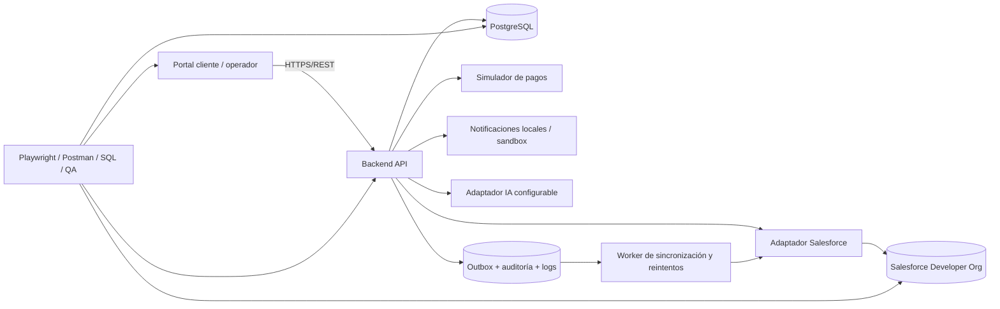

# PROJECT_BRIEF.md — Enterprise QA Lab
**Versión:** 0.2.0 · **Estado:** BASE APROBADA; detalles de Sprint 0 pendientes · **Fecha:** 2026-09-24  
**Naturaleza:** laboratorio personal reproducible; no constituye experiencia profesional ni producto comercial.

## 1. Propósito y límites
Construir y probar un sistema real de gestión de clientes, pedidos, pagos simulados, devoluciones y soporte, con CRM Salesforce y asistencia de IA. Recorrer requisitos → desarrollo → despliegue → QA → defectos → correcciones → retesting → regresión → UAT → decisión de release. El propietario ejecuta, verifica y puede explicar cada decisión y prueba. Ningún resultado de ejecución se declarará sin evidencia.

**Objetivos formativos:** QA funcional y exploratorio, API y datos, Salesforce QA, automatización, seguridad y performance controladas, CI/CD y evaluación de IA. Metas orientativas, no cuotas: 150–250 casos manuales; 100–150 checks automatizados; 60–100 evaluaciones de IA; 15–25 charters; 4–6 releases. La cobertura se define por riesgo, no por alcanzar cifras.

**Fuera de alcance inicial:** cobros reales, envíos físicos, correos a clientes reales, datos personales reales, app móvil nativa, integración con CRM de pago, entrenamiento de modelos propios y disponibilidad de producción comercial. Cypress, Appium y Karate requieren Change Request.

## 2. Caso de negocio: Northstar Commerce (empresa ficticia)
Una tienda ficticia vende accesorios de oficina a clientes registrados. Un cliente consulta catálogo, crea un pedido y realiza un pago **simulado**. Un operador revisa pedidos y solicitudes de devolución; soporte gestiona tickets. Salesforce almacena una representación CRM de clientes y casos de soporte; el backend mantiene pedidos, pagos, devoluciones y su estado transaccional. AI Quality se abordará posteriormente como línea de evaluación independiente con tickets sintéticos; la integración de IA en el producto NO está aprobada. El laboratorio incluye fallos intencionales controlados, datos legacy sucios, reintentos e incidentes de integración.

**Actores:** cliente; operador de pedidos; agente de soporte; administrador; servicio de integración; evaluador QA/UAT. Cada rol tiene permisos definidos y auditables. Los datos de clientes son sintéticos.

**Flujo principal:** registro/inicio de sesión → carrito/pedido → autorización simulada → confirmación → sincronización CRM según contrato → ticket o devolución → resolución y auditoría. Los estados, permisos y errores se definen por contrato antes de implementar.

**Indicadores del producto:** porcentaje de pedidos pagados simuladamente, devoluciones resueltas, tickets por categoría, sincronizaciones exitosas y pendientes. **Indicadores QA:** cobertura por riesgo/requisito, defectos por severidad, tasa de retest, flakiness, tiempos de pipeline, defect leakage simulado y criterios Go/No-Go.

## 3. Salesforce desde cero y su función
Salesforce es una plataforma CRM en la nube: gestiona información y procesos comerciales y de atención. Una **org** es un entorno Salesforce aislado. Sales Cloud se orienta a ventas y Service Cloud a atención; para el laboratorio se usarán capacidades disponibles en una Developer Org, sin asumir licencias completas de productos comerciales.

Un **objeto** equivale conceptualmente a una entidad/tablas de negocio; un **registro**, a una instancia/fila; un **campo**, a un atributo/columna. Objetos estándar como Account, Contact y Case conviven con objetos personalizados si la edición lo permite. **Lightning** es la interfaz; **page layouts** organizan campos; **record types** permiten variantes de procesos y presentación; **validation rules** rechazan datos inválidos; **Flows** automatizan procesos. **Profiles** y **permission sets** controlan capacidades; roles, jerarquías y reglas de sharing intervienen en acceso a registros. No confundir permiso de objeto, campo y registro. **SOQL** consulta datos Salesforce, no es SQL completo. API REST y credenciales autorizadas permiten integrar el backend; los límites y capacidades de la org deben verificarse.

**Responsabilidad propuesta:** PostgreSQL es la fuente de verdad de identidad local, catálogo, pedidos, pagos simulados, devoluciones y auditoría de la aplicación. Salesforce es fuente de verdad del ciclo de vida de Case y de datos CRM que allí se editen. El backend mantiene una proyección mínima de referencias CRM y un registro de sincronización. No replicar contraseñas ni datos de pago. La correspondencia entre cliente local y Contact/Account se establece con identificadores externos estables, nunca por nombre.

**Aprendizaje incremental:** org y navegación → objetos y registros → campos/relaciones → reglas y Flow → permisos/sharing → SOQL y API → despliegue y smoke post-deploy → pruebas de integración y reconciliación. Las funciones exactas dependen de la Developer Org efectivamente disponible.

## 4. Arquitectura propuesta

**Propuesta tecnológica, aún no aprobada:** frontend React + TypeScript; backend Node.js + Express + TypeScript; PostgreSQL; Docker Compose local; GitHub Actions; Playwright + TypeScript; Postman/Newman; Salesforce Developer Org. Un monolito modular con adaptadores y worker local reduce complejidad frente a microservicios. Selenium/Java se incorpora después como suite complementaria. IA fuera del SUT inicial: evaluación independiente posterior; una integración futura requerirá Change Request y aprobación de costos y tratamiento de datos.

**Contratos clave:** API versionada `/api/v1`; identificador de correlación; errores estructurados sin secretos; autenticación con sesión/token y expiración; autorización en servidor; idempotency key para pago simulado y creación de pedido donde aplique; transacciones DB; outbox para eventos; retries acotados con backoff y dead-letter local; reconciliación de estados y registros Salesforce. El frontend nunca invoca Salesforce con credenciales de servidor. Las operaciones CRM no bloquean la confirmación de un pago local ya persistido: se registra `sync_pending` y se reintenta. No afirmar entrega exactamente una vez: consumidores idempotentes y detección de duplicados.

**Ambientes aprobados:** DEV, QA y UAT se ejecutarán localmente en stacks Docker Compose separados, cada uno con su propia configuración, versión identificable y base PostgreSQL; no necesitan estar encendidos simultáneamente. PRD será una demo web pública con su propia base y datos sintéticos, sujeta a selección posterior de hosting gratuito/asequible, seguridad y persistencia. El despliegue público se evaluará después de estabilizar R1; hasta entonces PRD no existe. Los tres entornos locales comparten el equipo físico y no constituyen infraestructura independiente. Salesforce Developer Org compartida es una limitación explícita: usar prefijos, usuarios de prueba y limpieza; no prometer aislamiento equivalente a sandboxes reales. El diseño de topología definitiva queda pendiente.

**Seguridad y privacidad:** solo datos sintéticos; secretos en `.env` ignorado y GitHub Secrets; mínimo privilegio; control de acceso por rol y recurso; sanitización de logs; rate limiting; protección de sesiones; pruebas ZAP solo contra infraestructura propia; no enviar datos sensibles a modelos externos. Documentar límites de pruebas no funcionales locales.

## 5. Módulos y reglas iniciales
| Módulo | Responsabilidad | Reglas a precisar antes de desarrollo |
|---|---|---|
| Identidad | registro, login, sesión, roles | unicidad, bloqueo, expiración, matriz de permisos |
| Clientes/CRM | perfil local, vinculación Contact/Account | propiedad de campos, deduplicación, reconciliación |
| Catálogo | productos y disponibilidad | precio snapshot, stock simulado o real |
| Pedidos | carrito, total, estados | máquina de estados, concurrencia, cancelación |
| Pagos simulados | aprobar, rechazar, timeout, reintentar | idempotencia, no doble cobro simulado |
| Devoluciones | solicitud, revisión, resolución | elegibilidad, plazos, cantidad y reembolso simulado |
| Soporte | tickets, estados, asignación | SLA simulado, permisos, trazabilidad |
| IA (línea independiente posterior) | evaluación de clasificación y respuestas con tickets sintéticos | golden set, revisión humana, abstención y rubrics; integración al SUT no aprobada |
| Integración | sync CRM, errores, reintentos | ownership, mapeo, duplicados, rate limits |
| Auditoría/observabilidad | eventos, logs, métricas | correlación, redacción, retención |
| Migración legacy | importación y reconciliación | duplicados, incompletos, rechazados |

## 6. Backlog preliminar: 30 historias identificadas, 28 dentro del alcance propuesto y 2 condicionales
Las siguientes son títulos para refinamiento: cada historia necesitará descripción, valor, actor, criterios Given/When/Then, negativos, datos, permisos, riesgos y trazabilidad antes de pasar DoR.

| ID | Épica | Historia preliminar | Release objetivo |
|---|---|---|---|
| US-01 | Identidad | Cliente registra cuenta con validaciones | R1 |
| US-02 | Identidad | Usuario inicia y cierra sesión | R1 |
| US-03 | Identidad | Sistema aplica roles y permisos por recurso | R1 |
| US-04 | Clientes | Cliente consulta y edita su perfil | R1 |
| US-05 | Catálogo | Cliente consulta catálogo y detalle | R1 |
| US-06 | Catálogo | Operador administra productos | R1 |
| US-07 | Pedidos | Cliente crea pedido desde carrito | R1 |
| US-08 | Pedidos | Cliente consulta historial y detalle propio | R1 |
| US-09 | Pedidos | Operador consulta y cambia estados permitidos | R1 |
| US-10 | Pagos | Cliente ejecuta pago simulado aprobado/rechazado | R1 |
| US-11 | Pagos | Sistema maneja timeout y reintento idempotente | R2 |
| US-12 | Pedidos | Cliente cancela pedido elegible | R2 |
| US-13 | Devoluciones | Cliente solicita devolución elegible | R2 |
| US-14 | Devoluciones | Operador aprueba o rechaza devolución | R2 |
| US-15 | Devoluciones | Sistema registra reembolso simulado y auditoría | R2 |
| US-16 | Soporte | Cliente crea ticket vinculado a pedido | R2 |
| US-17 | Soporte | Agente asigna y actualiza ticket | R2 |
| US-18 | Soporte | Cliente consulta tickets propios | R2 |
| US-19 | Salesforce | Administrador configura modelo CRM mínimo | R3 |
| US-20 | Salesforce | Sistema vincula cliente local con Contact CRM | R3 |
| US-21 | Salesforce | Sistema sincroniza tickets con Case | R3 |
| US-22 | Integración | Sistema reintenta sync fallida sin duplicar | R3 |
| US-23 | Integración | Operador consulta estado y reconciliación de sync | R3 |
| US-24 | Seguridad | Administrador gestiona permisos y audita acciones | R3 |
| US-25 | Migración | Operador importa clientes legacy con validación | R4 |
| US-26 | Migración | Operador revisa duplicados/rechazos y conciliación | R4 |
| US-27 | IA (condicional) | Agente solicita clasificación sugerida de ticket | Backlog; requiere Change Request |
| US-28 | IA (condicional) | Agente revisa, edita o descarta respuesta sugerida | Backlog; requiere Change Request |
| US-29 | Observabilidad | Operador rastrea flujo por correlation ID | R5 |
| US-30 | Resiliencia | Sistema recupera operaciones tras fallos controlados | R5 |

**Épicas:** E01 Identidad/seguridad; E02 Clientes/CRM; E03 Catálogo; E04 Pedidos; E05 Pagos; E06 Devoluciones; E07 Soporte; E08 Integración Salesforce; E09 Migración; E10 IA; E11 Observabilidad/resiliencia. Las historias transversales de QA, documentación y CI/CD se gestionan como tareas habilitadoras y criterios DoD, no se cuentan artificialmente como funcionalidad.

## 7. Releases y escenarios de calidad
| Release | Incremento funcional | Pruebas y cambios controlados |
|---|---|---|
| R0 — Foundation | infraestructura, contratos y vertical slice acordado | health check, seed, smoke y pipeline básico |
| R1 — Commerce Core | US-01–10 | UI/API/DB, roles, límites, estados, defectos y retest |
| R2 — Service & Returns | US-11–18 | timeouts, reintentos, transición de estados, regresión |
| R3 — CRM Integration | US-19–24 | permisos Salesforce, sync, duplicados, fallos y reconciliación |
| R4 — Legacy & AI Evaluation | US-25–26; evaluación IA independiente | importación sucia, golden set, revisión humana y prompt injection en dataset sintético; US-27–28 solo mediante Change Request |
| R5 — Hardening & Release | US-29–30 y fixes | carga, accesibilidad, ZAP controlado, UAT, rollback, Go/No-Go |

R0 es release técnica, no funcional. R1–R5 son cinco incrementos planificados; el alcance se ajustará por Change Request y capacidad real. No introducir bugs ocultos: inyectar fallos en ramas/fixtures controlados y documentados para prácticas de detección.

## 8. Fases y sprints (duración propuesta: 2 semanas, ajustable)
| Fase | Sprints tentativos | Salida verificable |
|---|---|---|
| Descubrimiento | Sprint 0 | decisiones, requisitos base, riesgos, repositorio documental y DoR |
| Fundación | S1–S2 | R0, entorno reproducible, contratos y smoke |
| Comercio | S3–S5 | R1, casos y evidencias |
| Servicio | S6–S8 | R2, regresión y UAT |
| CRM | S9–S11 | R3, Salesforce desde cero, integración y reconciliación |
| Migración y evaluación IA independiente | S12–S14 | R4, dataset legacy, golden set y rubrics; sin integración IA en la aplicación |
| Robustez y cierre | S15–S17 | R5, performance, seguridad, Selenium POC y portfolio |

Los sprints son una **estimación de planificación**, no fechas ni compromiso de velocidad. Al cierre de cada sprint: demo ejecutada, resultados reales, bugs y decisiones registrados, retrospectiva y próximo backlog. Salesforce puede comenzar como aprendizaje paralelo antes de S9 sin conectar el sistema hasta que la base esté estable.

## 9. Sprint 0: preparación sin programación
**Objetivo:** acordar un producto testeable y un plan de trabajo realista; no desarrollar aplicación.

**Capacidad aprobada:** sprints de 2 semanas, 10–12 horas semanales (20–24 horas por sprint), incluyendo aprendizaje y documentación; la duración total del roadmap es tentativa.

**Orden de ejecución y entregables:**
1. Revisar este brief consolidado y validar detalles abiertos de ejecución, costos, cuentas y criterios medibles.
2. Definir 3 personas, 5 flujos críticos y límites del MVP; dibujar contexto y ownership de datos.
3. Refinar US-01, US-07 y US-10: criterios, negativos, estados, permisos y riesgos; crear matriz inicial requisito→prueba.
4. Redactar estrategia QA v0.1: niveles, tipos, ambientes, datos, severidad/prioridad, entrada/salida, evidencia y Go/No-Go.
5. Definir DoR/DoD, política de defectos, nomenclatura y estructura de repositorio; decidir Jira/Xray o alternativa explícita.
6. Verificar acceso a cuentas gratuitas y límites reales sin almacenar credenciales; registrar evidencias de disponibilidad.
7. Verificar prerrequisitos del ADR-001 aceptado y preparar backlog ordenado de S1. **No crear código ni desplegar durante Sprint 0.**

**DoR de historia:** valor/actor claros, reglas y dependencias explícitas, criterios verificables incluidos negativos, datos y permisos definidos, ambiente y riesgos identificados, tamaño razonable.  
**DoD de historia:** PR/review, implementación y contrato actualizados, tests pertinentes ejecutados con evidencia, defectos gestionados, regresión proporcional al riesgo, trazabilidad y documentación/PROJECT_STATE actualizados. No equivale a “sin bugs”: los residuales requieren aceptación explícita.

**Severidad sugerida:** blocker (flujo crítico inaccesible o riesgo grave), critical (pérdida/corrupción o autorización grave), major (función central incorrecta), minor (impacto limitado), trivial (cosmético). Prioridad se decide separadamente por impacto, urgencia y alcance. **Go/No-Go aprobado:** smoke crítico completo; sin defectos Blocker/Critical abiertos; regresión obligatoria superada; UAT simulado registrado y aprobado; sin vulnerabilidades críticas conocidas sin resolver; evidencias y trazabilidad; procedimiento de rollback probado o documentado según riesgo. Toda excepción requiere decisión explícita y documentada, nunca se presume. Umbrales cuantitativos definitivos pendientes.

## 10. Estrategia QA y trazabilidad
**Diseño:** equivalencia, valores límite, tablas de decisión, transiciones, pairwise justificado, error guessing y sesiones exploratorias con charter. Para cada historia: requisitos ↔ casos ↔ ejecución ↔ bugs ↔ fixes ↔ retest ↔ regresión ↔ release. Evidencia: fecha, build/commit, ambiente, datos sintéticos, pasos, resultado esperado/actual, capturas/logs redactados y enlace a bug.

**Capas:** unitarias del DEV; API/contrato y SQL/PostgreSQL; UI/E2E Playwright; Salesforce UI/API/SOQL y permisos; integración y reconciliación; Newman CI; Selenium + Java 8–12 flujos como POC posterior; k6 para latencia p50/p95/p99, throughput, errores y concurrencia; accesibilidad; ZAP solo en local; evaluación IA offline y, si se aprueba, con modelo real. Evitar automatizar todos los casos manuales: priorizar flujos estables y repetibles.

**IA Quality:** dataset sintético versionado; golden labels revisadas por humano; métricas por clase, abstención, relevancia, groundedness, consistencia, seguridad, sesgos, fuga de datos y resistencia a prompt injection. Comparar versiones con mismas entradas y parámetros registrados; no presentar una métrica única como prueba de seguridad. Una sugerencia de IA nunca envía respuesta sin aprobación humana.

## 11. Herramientas, cuentas, costos y restricciones
| Herramienta/cuenta | Uso | Costo previsto y condición |
|---|---|---|
| Git/GitHub personal | fuente permanente, PR y Actions | plan gratuito con límites de Actions/almacenamiento; verificar vigencia |
| VS Code, Node.js, Java JDK, Maven | desarrollo y suite legacy | distribuciones gratuitas; revisar licencias concretas |
| Docker Desktop o Docker Engine | ejecución local | elegibilidad de licencia de Desktop según uso; Engine en Linux |
| PostgreSQL | persistencia | software libre; consume recursos locales |
| Salesforce Developer Org | CRM de aprendizaje | acceso gratuito sujeto a elegibilidad, límites y políticas vigentes |
| Postman + Newman | diseño/ejecución API | plan gratuito con límites; Newman CLI gratuito |
| Playwright + TypeScript | automation principal | software gratuito; CI consume minutos |
| Selenium + JUnit/TestNG + Allure | POC legacy | herramientas gratuitas; ejecución consume recursos |
| Jira + Xray | historias/bugs y gestión de pruebas | Xray es primera opción, no asumir licencia gratuita permanente; verificar costos y disponibilidad antes de cargar casos |
| k6 y OWASP ZAP | no funcional | herramientas gratuitas; solo sistemas propios; JMeter fuera del alcance inicial |
| MkDocs/GitHub Pages | publicación futura | opciones gratuitas sujetas a límites y visibilidad |
| Proveedor IA externo | evaluación independiente posterior | **potencial costo por uso**; no activar sin aprobación y presupuesto; no integrar al SUT inicialmente |
| Dominio/hosting demo público | opcional | no asumir free tier sostenible; investigar antes de activar |

No se verificaron aquí precios, cuotas ni disponibilidad de cuentas: son hipótesis para confirmar en Sprint 0 antes de comprometerse. No comprar, contratar ni habilitar facturación sin aprobación.

**Dependencias críticas:** equipo con RAM/espacio suficiente; Docker operativo o alternativa local; GitHub; PostgreSQL; decisiones de autenticación y datos; acceso a Developer Org antes de R3; permisos de API para integración; datos sintéticos y credenciales seguras; disponibilidad del SUT antes de pruebas E2E. Si falla una dependencia crítica, bloquear el trabajo dependiente y registrar mitigación, no simular éxito.

## 12. Riesgos iniciales
| ID | Riesgo | Mitigación / disparador |
|---|---|---|
| RK-01 | alcance excesivo para una persona | vertical slice, WIP bajo, revisar alcance por sprint |
| RK-02 | límites/indisponibilidad de Salesforce | validar org/API temprano; adaptador con contrato y pruebas separadas |
| RK-03 | costo o exposición de datos en IA | stub inicial, dataset sintético, presupuesto y aprobación previa |
| RK-04 | tests frágiles/ambientes no aislados | seeds deterministas, fixtures, contratos y trazas |
| RK-05 | doble operación por retries | claves idempotentes, constraints, outbox y reconciliación |
| RK-06 | secretos o datos publicados | .gitignore, secret scanning, revisión de evidencias |
| RK-07 | CI/hosting gratuito insuficiente | pipeline mínimo local y medición de cuotas |
| RK-08 | Salesforce compartido contamina QA/UAT | namespace, datasets, limpieza y limitación declarada |
| RK-09 | métricas de IA poco reproducibles | golden set versionado, rubrics y revisión humana |
| RK-10 | portfolio confunde laboratorio con empleo | etiqueta visible “proyecto personal / simulated environments” |

## 13. Repositorio y documentación
```text
enterprise-qa-lab/
├── README.md                 # English
├── README.es.md              # Español
├── PROJECT_BRIEF.md          # especificación maestra, versión controlada
├── PROJECT_STATE.md          # estado real y próximo paso
├── docs/
│   ├── en/                  # estrategia, requisitos, UAT, releases
│   ├── es/                  # equivalentes y tutoriales
│   ├── adr/                 # ADR-001 y siguientes
│   ├── requirements/        # épicas, historias, AC, matrices
│   ├── qa/                  # planes, casos, charters, bugs
│   ├── salesforce/          # configuración y pruebas
│   ├── ai-evaluation/       # datasets sintéticos, rubrics, resultados
│   └── releases/            # notas, Go-No-Go, RCA, retrospectivas
├── diagrams/
├── evidence/                # muestras redactadas; nunca secretos
├── reports/                 # reportes reproducibles o enlaces
├── apps/                    # futuro: web y API (mismo repositorio)
├── integrations/            # futuro: Salesforce, pagos, IA
├── tests/                   # futuro: API, UI, Selenium, performance
├── postman/                 # futuro
├── database/                # futuro: migraciones, seeds y SQL
└── .github/                 # futuro: CI y templates
```
Código, ramas, commits, nombres de tests y defectos técnicos en inglés; documentación principal en español e inglés, priorizando exactitud sobre traducción simultánea inmediata. `PROJECT_STATE.md` se actualiza después de cada sesión con evidencia; no inventar links ni resultados. Versionar cambios por PR y decisiones en ADR; propuestas nuevas por Change Request con valor, impacto, riesgo, esfuerzo y decisión explícita.

## 14. Registro de decisiones aprobadas y verificaciones pendientes
| ID | Decisión aprobada | Detalles aún por definir |
|---|---|---|
| D01 | Northstar Commerce, comercio ficticio | nombre comercial definitivo si se desea cambiar |
| D02 | MVP: registro/login, catálogo, pedidos, pagos simulados e historial | reglas y criterios de cada historia |
| D03 | React + TypeScript, Node.js + TypeScript, PostgreSQL y Docker Compose | versiones y requisitos del equipo |
| D04 | Express + TypeScript | librerías de validación y acceso a datos |
| D05 | Monolito modular, adaptador Salesforce y sincronización resiliente | contrato de outbox/retries antes de R3 |
| D06 | Sesiones con cookies HttpOnly | almacenamiento de sesión, CSRF, expiración y matriz de permisos |
| D07 | Inventario simple y precio histórico en pedido | momento de reserva/descuento y concurrencia |
| D08 | Salesforce: Account, Contact y Case | campos y relaciones según org real |
| D09 | Aplicación: usuarios, catálogo, pedidos, pagos y devoluciones; Salesforce: datos CRM y estado/resolución de Case | propiedad campo por campo, actualización y reconciliación |
| D10 | Jira para historias/bugs; Xray primera opción para casos/planes/ejecuciones; si no es viable, evaluar Zephyr y Kiwi TCMS | acceso, licencia, integración y prueba de concepto; GitHub NO sustituye gestor de casos |
| D11 | AI Quality independiente y posterior; integración IA al SUT diferida | proveedor, dataset y presupuesto; US-27/28 condicionadas a CR |
| D12 | DEV/QA/UAT: Docker local separado; PRD: demo web pública independiente tras estabilizar R1 | hosting, seguridad, costos y aislamiento Salesforce |
| D13 | Sprints de 2 semanas; dedicación de 10–12 h/semana | calendario y capacidad real por sprint |
| D14 | GitHub único para SUT y QA, documentación principal bilingüe; código/commits/tests en inglés | publicación con MkDocs tras estabilización |
| D15 | k6; JMeter fuera del alcance inicial | cargas y thresholds medidos |
| D16 | Go/No-Go con smoke, defectos, regresión, UAT, seguridad, evidencias y rollback | umbrales cuantitativos y excepciones |
| D17 | No separar DEV y QA en repositorios: un único Enterprise QA Lab | carpetas y responsabilidades por chat |

**Pagos:** simulador propio funcional, persistente y determinista; no usar Stripe, Mercado Pago ni transacciones reales.  
**UAT:** validación de negocio simulada y etiquetada como tal; no afirmar participación de usuarios empresariales reales.  
**Estado:** decisiones de alcance aprobadas verbalmente por el propietario en este chat; la disponibilidad de cuentas, licencias, hosting y capacidades de Salesforce NO fue verificada. La aprobación del plan no equivale a autorización de compras, publicación pública inmediata ni implementación automática.
